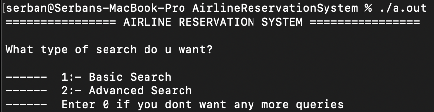
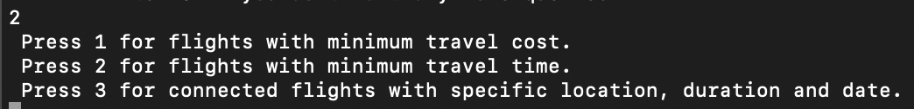

# AirlineReservationSystem

This is a system for booking airline tickets and hotel accommodation.

## Description

This project provides a booking system for airline ticket and hotel accommodation options. Users can search for direct or connected flights, check ticket availability and prices, and get information about accommodation options.

## Features

- Search and book direct or connected flights.
- Check availability and ticket prices.
- Detailed information about each flight, including airline, ticket price, departure and arrival time, flight duration, etc.
- Ability to search for available hotels in your chosen destination.

## Usage

To use the system, follow these steps:

1. Compile and run the program using `g++ main.cpp` and `./a.out`.
2. Choose the type of search (Basic Search or Advanced Search) and follow the on-screen instructions.

